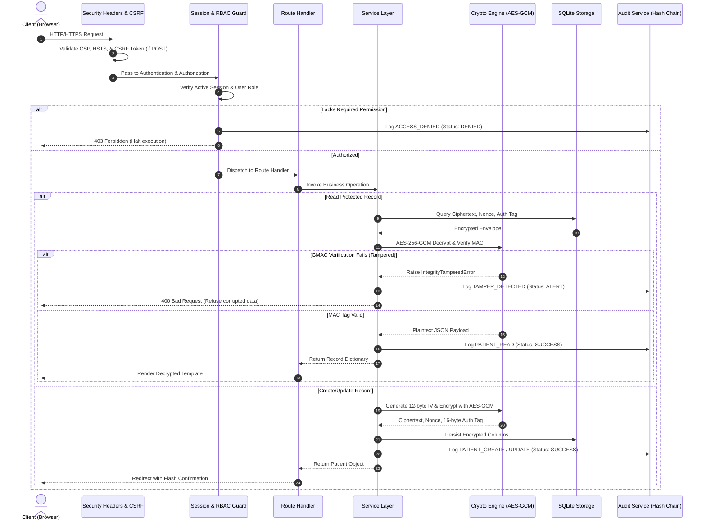
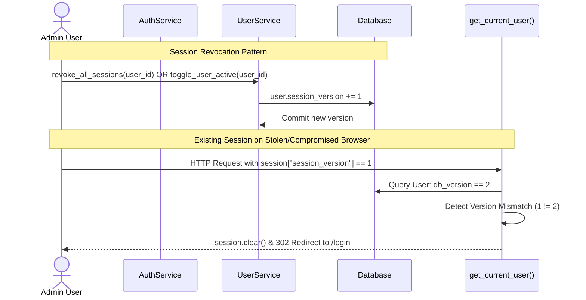
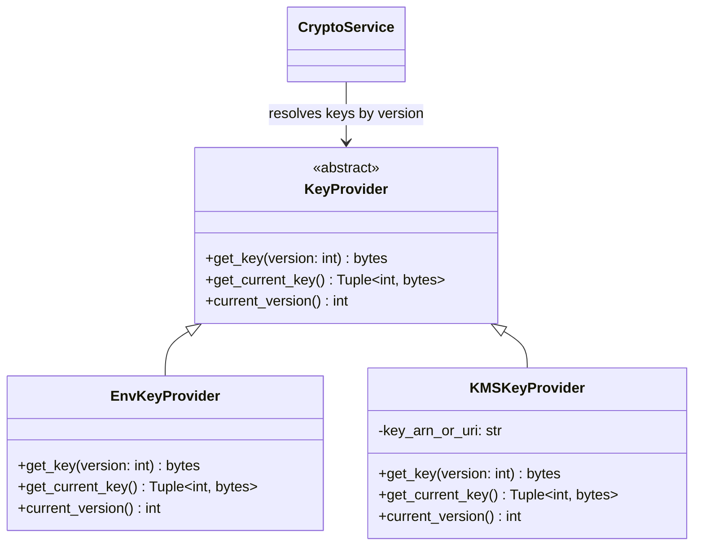
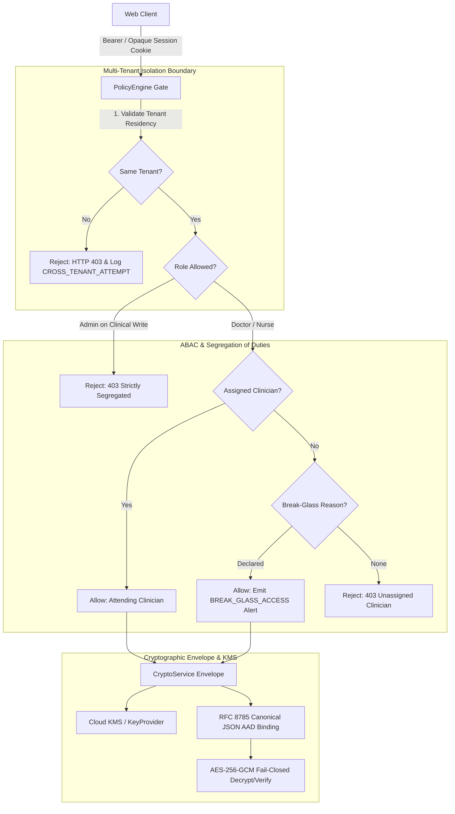

# System Architecture & Technical Specification

**Course:** Cryptography and Network Security — 26ECSC403  
**Project:** ArogyaRaksha  
**Institution:** KLE Technological University

---

## 1. High-Level Architecture Overview

The system is designed with a strict layered architecture to ensure **separation of concerns**, prevent code duplication, and enforce security controls at the server level.

```mermaid
graph TD
    Client[Web Browser / API Client] -->|HTTPS / TLS 1.3| WebServer[Flask Web Server]
    
    subgraph Security Layer
        WebServer --> Talisman[Flask-Talisman: CSP, HSTS, X-Frame-Options]
        Talisman --> Limiter[Flask-Limiter: IP Rate Limiting]
        Limiter --> CSRF[Flask-WTF: CSRF Validation]
        CSRF --> SessionGuard[Session Check & Fixation Defense]
        SessionGuard --> RBAC[@require_permission Decorator]
    end

    subgraph Service Layer
        RBAC --> RouteHandlers[Route Handlers: HTTP endpoints only]
        RouteHandlers --> PatientService[patient_service]
        RouteHandlers --> AuthService[auth_service]
        RouteHandlers --> UserService[user_service]
    end

    subgraph Core Cryptography & Audit
        PatientService --> CryptoService[crypto_service: AES-256-GCM]
        PatientService --> AuditService[audit_service: SHA-256 Chaining]
        AuthService --> AuditService
        UserService --> AuditService
    end

    subgraph Persistence Layer
        CryptoService --> DB[(SQLite Database: healthcare.db)]
        AuditService --> DB
        UserService --> DB
    end
```

### Architectural Principles:
1. **Routes are Dumb:** Route handlers strictly process HTTP parameters, invoke the service layer, and render Jinja2 templates or return HTTP error codes. No SQL queries, AES encryption calls, or authorization checks exist directly inside route handler bodies.
2. **Services Orchestrate:** All business logic, record creation, user modification, and data retrieval are coordinated within `app/services/`.
3. **Dedicated Cryptographic Primitives:** `app/services/crypto_service.py` encapsulates all AES-256-GCM operations, key retrieval, nonce generation, and GMAC tag verification.

---

## 2. Complete Request Lifecycle

Every incoming request to a protected endpoint undergoes an 8-stage verification pipeline:



---

## 3. Role-Based Access Control (RBAC) Matrix

Server-side permissions are defined in `app/security/permissions.py` and strictly enforced by `@require_permission`:

| Permission | Description | Doctor | Nurse | Admin |
|---|---|:---:|:---:|:---:|
| `PATIENT_READ` | View list of patients and decrypt full clinical records | ✓ | ✓ | ✓ |
| `PATIENT_CREATE` | Register and encrypt new patient records | ✓ | ✓ | ✗ |
| `PATIENT_UPDATE` | Edit and re-encrypt existing clinical diagnoses and notes | ✓ | ✗ | ✗ |
| `PATIENT_DELETE` | Soft-delete / archive patient record (removes from active views) | ✓ | ✗ | ✗ |
| `USER_MANAGE` | Create new user accounts, toggle active/disabled states | ✗ | ✗ | ✓ |
| `AUDIT_READ` | Inspect chronological audit log and verify cryptographic hash chain | ✗ | ✗ | ✓ |

### 3.1 Authentication Hardening & Session Revocation (Phase 4)



1. **Multi-Factor Authentication (TOTP / RFC 6238):**
   - High-entropy Base32 secret generation with `pyotp`.
   - Optional for clinicians, mandatory for Admin role (`MFA_ENFORCE_ADMIN`).
   - **Grace Login Policy:** Un-enrolled administrators are permitted login but immediately redirected to `/admin/settings/mfa` and blocked from general administrative capabilities until a valid 6-digit TOTP code confirms setup.
2. **Cryptographic Password Reset Flow:**
   - Single-use 32-byte cryptographically secure random token, stored as a SHA-256 hash.
   - Strict 15-minute expiration window (`expires_at`).
   - Constant-time user-enumeration defense: returns identical response regardless of username existence.
   - Updating password automatically increments `session_version`, terminating all preexisting active sessions across browsers.
3. **Server-Side Session Revocation:**
   - `User.session_version` is embedded in the signed cookie on login (`session["session_version"]`).
   - `get_current_user()` actively verifies that `session["session_version"] == user.session_version`.
   - Calling `UserService.revoke_all_sessions(user_id)` or disabling an account via `toggle_user_active()` increments `session_version`, invalidating all active sessions in real time.

### 3.2 Soft-Delete Architecture & Security Alerting (Phase 5)

1. **Compliance-Safe Soft-Delete:**
   - Healthcare compliance (HIPAA &sect; 164.312, DPDP Act 2023) mandates that clinical histories cannot be destroyed via physical row deletion (`DELETE FROM patients`).
   - The `Patient.deleted_at` timestamp column tracks when a record was archived.
   - All active queries (`list_patients`, `get_patient_by_id`, `update_patient`) strictly filter `Patient.deleted_at.is_(None)`.
   - Gated exclusively to the `Doctor` role via `PATIENT_DELETE` permission (`POST /patients/<id>/delete`). Nurse and Admin roles attempting deletion receive `403 Forbidden` and write `ACCESS_DENIED` to the audit log.
   - Every deletion generates a `PATIENT_DELETE` event in the tamper-evident audit ledger.

2. **Security Operations Alerting (`AlertService`):**
   - Decoupled notification architecture supporting swappable `AlertDelivery` backends:
     - `LogOnlyDelivery`: Dispatches structured JSON alerts to dedicated `security.alert` logger at `CRITICAL` severity.
     - `WebhookDelivery`: Enterprise stub demonstrating HMAC-SHA256 authenticated webhook dispatch (`X-Arogya-Signature`) to external SIEM / SOC tools.
   - Automatically triggered on critical security incidents:
     - `TAMPER_DETECTED`: When AES-256-GCM MAC authentication fails (bit-flip or tag forgery).
     - `ACCOUNT_LOCKOUT`: When brute-force rate limits are breached on authentication endpoints.

> **Security Guarantee:** Direct URL navigation to forbidden routes (e.g., a Nurse requesting `/patients/1/edit` or a Doctor requesting `/admin/users`) is trapped by `@require_permission`, immediately writes an `ACCESS_DENIED` entry to the audit log, and returns `403 Forbidden`. The UI dynamically conceals buttons solely for usability, never as a substitute for server checks.

---

## 4. Cryptographic Storage Specification (AES-256-GCM)

Sensitive patient fields are never stored as plaintext in the database. 

### Protected Fields:
- Patient Legal Name
- Primary Diagnosis
- Medical History & Allergies
- Clinical Observations & Treatment Notes

### Encryption Procedure:
1. Sensitive fields are structured as a dictionary:
   ```json
   {
     "name": "Jane Doe",
     "diagnosis": "Type 2 Diabetes Mellitus",
     "medical_history": "Hypertension diagnosed 2018. Penicillin allergy.",
     "notes": "Fasting blood sugar 145 mg/dL. Metformin 500mg BID."
   }
   ```
2. The payload is canonically serialized to UTF-8 JSON bytes.
3. A fresh, cryptographically secure 12-byte initialization vector (`nonce`) is generated using `Crypto.Random.get_random_bytes(12)`.
4. The payload is encrypted using `AES.new(MASTER_KEY, AES.MODE_GCM, nonce=nonce)`.
5. The cipher generates the ciphertext and a 16-byte (128-bit) authentication tag (`auth_tag = cipher.digest()`).
6. The ciphertext, nonce, auth tag, and key version are stored as hex-encoded strings in the `patients` table.

### Decryption & Tamper Verification:
1. The ciphertext, nonce, and auth tag are converted from hex bytes.
2. The decryption key is resolved dynamically by `KeyProvider.get_key(patient.key_version)` from the multi-version `KEY_REGISTRY`.
3. An AES cipher is initialized with `AES.new(version_key, AES.MODE_GCM, nonce=nonce)`.
4. `cipher.decrypt_and_verify(ciphertext, auth_tag)` simultaneously decrypts the data and recalculates the Galois MAC over the ciphertext.
5. If a single bit in the ciphertext or tag has been altered, the MAC recalculation fails, raising `ValueError` in PyCryptodome.
6. The service intercepts this exception, raises `IntegrityTamperedError`, appends `TAMPER_DETECTED` to the audit log, and suppresses all data rendering.

### 4.1 Key Management Architecture & Zero-Downtime Rotation (Phase 3)

Key management is decoupled from low-level cryptographic operations via the `KeyProvider` interface:



1. **`KeyProvider` Abstraction:** Defines `get_key(version)`, `get_current_key()`, and `current_version()`.
2. **`EnvKeyProvider`:** Reads multi-version 32-byte keys from `KEY_REGISTRY` (configured via `KEY_REGISTRY_JSON` or `ENCRYPTION_KEY_v<N>`). Supports seamless multi-version decryption: records encrypted with key version 1 remain readable even after key version 2 is activated.
3. **`KMSKeyProvider`:** Enterprise integration stub for hardware-backed KMS solutions (AWS KMS, Google Cloud KMS, HashiCorp Vault Transit engine).
4. **Key Rotation CLI (`scripts/rotate_keys.py`):**
   - Safely re-encrypts historical records in configurable batches (default 50) using fresh nonces.
   - Idempotent and resumable: only processes records where `key_version != target_version`.
   - Records an immutable `KEY_ROTATION` audit event per batch to provide cryptographic traceability.

---

## 5. Tamper-Evident Audit Trail (Cryptographic Hash-Chaining)

To ensure non-repudiation and detect any unauthorized database tampering, every audit log entry is linked to its predecessor via SHA-256 hash-chaining:

$$\text{Block}_0 = \text{GENESIS\_HASH} = 0000000000000000000000000000000000000000000000000000000000000000$$

$$\text{Block}_N = \text{SHA256}(\text{prev\_hash}_{N-1} \parallel \text{user\_id} \parallel \text{username} \parallel \text{action} \parallel \text{resource\_type} \parallel \text{resource\_id} \parallel \text{ip\_address} \parallel \text{status} \parallel \text{details} \parallel \text{timestamp})$$

### Verification Mechanism:
The verification function `AuditService.verify_chain()` scans the entire sequence from $ID=1$ to $ID=N$:
1. Checks that $\text{prev\_hash}_i == \text{record\_hash}_{i-1}$.
2. Recomputes $\text{SHA256}(\text{fields})$ and compares it against $\text{record\_hash}_i$.
3. Any modified row immediately produces a hash mismatch, identifying the exact tampered record ID.

### Concurrency Safety (Phase 1)

The `prev_hash` column carries a `UNIQUE` database constraint. This means no two records
can share the same `prev_hash`, which would indicate a forked chain.

`AuditService.log_event()` uses a **retry-on-conflict** pattern:

- **PostgreSQL (production):** The tail row is fetched with `SELECT ... FOR UPDATE`, row-locking
  it for the duration of the inner transaction. A concurrent writer cannot commit a record with
  the same `prev_hash` until the lock is released. If a race still occurs (e.g., between the
  `FOR UPDATE` read and the `flush`), an `IntegrityError` is caught, the savepoint is rolled
  back, and the tail is re-read. Bounded to `MAX_CHAIN_RETRIES = 5`.
- **SQLite (development only):** A module-level `threading.Lock` serialises same-process writers.

> [!WARNING]
> **SQLite is NOT safe for concurrent multi-process writers.** Running Gunicorn with `>1` worker
> processes against a SQLite database will bypass the threading lock and can produce chain forks.
> SQLite is strictly a **single-process development database**. All production deployments must use
> PostgreSQL (configured via `DATABASE_URL`). This is enforced by the startup production warning
> added in BUG-04.

---

## 6. Database Concurrency Model

| Backend | Audit chain safety | Patient writes | Notes |
|---|---|---|---|
| SQLite (dev) | Thread-safe (same process) | OK for single worker | Do NOT use with Gunicorn workers > 1 |
| PostgreSQL (prod) | Row-locked (`SELECT FOR UPDATE`) | Full MVCC isolation | Required for any multi-worker deployment |

For production: set `DATABASE_URL=postgresql+psycopg://...` and `RATELIMIT_STORAGE_URI=redis://...`.
Both are pre-configured in `docker-compose.yml`.

---

## 7. Query Scalability & Encrypted-Field Search Boundary (Phase 2)

### 7.1 Server-Side Pagination
Full-table scans in the UI have been eliminated:
- `PatientService.list_patients()` returns a `Pagination` object using `page` and `per_page` query parameters (default 25, clamped to `[1, 100]`).
- `/admin/audit` uses server-side pagination (default 50, clamped to `[1, 200]`) with indexed composite filtering `(action, timestamp)`.

### 7.2 Encrypted-Field Search Boundary
A critical architectural boundary is maintained regarding searching clinical data:

| Field | Storage Type | Searchable Server-Side? | Method |
|---|---|---|---|
| `patient_id` | Plaintext (Indexed) | Yes | Case-insensitive prefix/substring (`ILIKE %q%`) |
| `age_band` | Plaintext | Yes | Exact match (`=` operator) |
| `gender` | Plaintext | Yes | Exact match (`=` operator) |
| `name` | AES-256-GCM Ciphertext | **NO** | Kept encrypted at rest |
| `diagnosis` | AES-256-GCM Ciphertext | **NO** | Kept encrypted at rest |
| `medical_history` | AES-256-GCM Ciphertext | **NO** | Kept encrypted at rest |
| `notes` | AES-256-GCM Ciphertext | **NO** | Kept encrypted at rest |

> [!IMPORTANT]
> **Why encrypted fields are NOT searchable server-side:**  
> In ArogyaRaksha, sensitive clinical fields (`name`, `diagnosis`, `medical_history`, `notes`) are encrypted as a JSON payload under AES-256-GCM with unique 96-bit random nonces. Performing server-side string filtering on ciphertext is cryptographically impossible without either:
> 1. **Bulk decryption in memory:** Decrypting every table row on each query exposes all clinical PHI in memory, creates side-channel timing vulnerabilities, and destroys query scalability ($O(N)$ decryptions).
> 2. **Searchable Symmetric Encryption (SSE) / Deterministic Encryption:** Using deterministic IVs or blind indexes leaks frequency distributions and equality patterns, violating IND-CPA and HIPAA/DPDP 2023 privacy expectations.
>
> Therefore, server-side filtering is strictly confined to non-PHI clear metadata indices (`patient_id`, `age_band`, `gender`). Full clinical inspection requires targeted record decryption (`GET /patients/<id>`) by an authorized role, triggering an audited `PATIENT_READ` event.

---

## 8. Browser Security & Modern Transport Headers (Phase 6)

ArogyaRaksha strictly isolates the client-side browsing context using modern W3C security headers and dynamic cryptographic nonces:

### 8.1 Cryptographic CSP Nonces (No `'unsafe-inline'`)
- Dynamic base64/urlsafe nonces are generated per request via `secrets.token_urlsafe(16)` and injected into Jinja2 templates (`{{ csp_nonce() }}`).
- Flask-Talisman binds the nonce into `script-src 'nonce-<value>'`.
- `'unsafe-inline'` has been completely eliminated from `script-src`. Any inline script injected via XSS is blocked by the browser because it cannot forge the server's per-request nonce.

### 8.2 Modern Header Enforcement

| Header | Value | Purpose |
|---|---|---|
| `Content-Security-Policy` | `default-src 'self'; script-src 'self' 'nonce-...'; style-src 'self' 'unsafe-inline' https://fonts.googleapis.com; frame-ancestors 'none'; object-src 'none'` | Anti-XSS, anti-clickjacking, data exfiltration defense |
| `Permissions-Policy` | `camera=(), microphone=(), geolocation=(), payment=(), usb=()` | Disables device hardware APIs to prevent browser-level sensor snooping |
| `Cross-Origin-Opener-Policy` | `same-origin` | Isolates window context; protects against XS-Leaks and Spectre-style side channels |
| `Cross-Origin-Resource-Policy`| `same-origin` | Restricts asset consumption to the originating site |
| `X-Frame-Options` | `DENY` | Prevents framing in iframes across all domains |
| `X-Content-Type-Options` | `nosniff` | Disables MIME-type sniffing |
| `X-Permitted-Cross-Domain-Policies` | `none` | Disallows cross-domain Adobe Flash / Acrobat policy files |
| `Referrer-Policy` | `strict-origin-when-cross-origin` | Protects privacy by omitting sensitive query paths when navigating externally |

---

## 9. Production Deployment Architecture (Phase 7)

```
       [ Client / Browser ]
                │
                │ HTTPS (TLS Termination)
                ▼
      [ Reverse Proxy / Load Balancer ]
                │
                │ HTTP (Header forwarding: X-Forwarded-For, X-Forwarded-Proto)
                ▼
     ┌────────────────────────────────────────────────────────┐
     │ Docker Container: arogya-web (UID 10001: arogya)       │
     │                                                        │
     │   Gunicorn Master Process (gunicorn.conf.py)           │
     │   ├── Worker 1 (Sync) ──► Flask WSGI App Instance      │
     │   ├── Worker 2 (Sync) ──► Flask WSGI App Instance      │
     │   ├── Worker 3 (Sync) ──► Flask WSGI App Instance      │
     │   └── Worker 4 (Sync) ──► Flask WSGI App Instance      │
     │                                                        │
     │   Healthcheck: GET /healthz (Every 30s)                │
     └──────────────┬────────────────────────┬────────────────┘
                    │                        │
     SQLAlchemy / Psycopg                    │ Flask-Limiter Storage
     (PostgreSQL Wire Protocol)              │ (Redis Protocol)
                    ▼                        ▼
     ┌────────────────────────┐   ┌───────────────────────────┐
     │ Docker Container:      │   │ Docker Container:         │
     │ arogya-db              │   │ arogya-redis              │
     │ PostgreSQL 16 Alpine   │   │ Redis 7 Alpine            │
     │ (MVCC, Row Locking)    │   │ (Rate Limit Buckets)      │
     └────────────────────────┘   └───────────────────────────┘
```

### 9.1 Multi-Stage Containerization (`Dockerfile`)
- **Stage 1 (Builder):** Uses `python:3.12-slim` with temporary build tools (`gcc`, `libpq-dev`) to build and isolate wheels in `/opt/venv`. No build toolchains or package managers are retained in the final image.
- **Stage 2 (Runtime):** Hardened `python:3.12-slim` containing only the minimal runtime libraries (`libpq5`, `curl`).
- **Principle of Least Privilege:** Executes under a dedicated system user and group `arogya` with UID `10001`. The container runs rootless, preventing container escape privileges.
- **Healthcheck:** Evaluates container health using `curl -f http://127.0.0.1:5000/healthz || exit 1` every 30s.

### 9.2 WSGI Worker Model & Cryptographic Concurrency
- Production utilizes Gunicorn with **4 synchronous workers** (`worker_class = "sync"`), configured via `gunicorn.conf.py` and `Procfile`.
- > [!CAUTION]
  > **Why Asynchronous Workers (gevent/eventlet) are Strictly Prohibited:**  
  > Asynchronous cooperative-multitasking frameworks monkey-patch Python standard library primitives (`socket`, `select`, `threading`). PyCryptodome and OpenSSL/cryptography rely on native C extensions and operating system entropy (`os.urandom` / `getrandom`). Monkey-patching can cause non-thread-safe C-level reentrancy, corrupting cryptographic PRNG entropy pools during AES-256-GCM IV creation or deadlocking inside OpenSSL cipher contexts. Synchronous process-isolated workers provide complete memory and cryptographic state isolation.

### 9.3 Orchestration & Storage Topology (`docker-compose.yml`)
- **`web` Service:** Binds Gunicorn to port 5000. Depends on `db` and `redis` passing their respective container healthchecks before starting.
- **`db` Service:** PostgreSQL 16 Alpine with persistent volume `postgres_data`. Validated by `pg_isready -U arogya_user -d arogya_db`.
- **`redis` Service:** Redis 7 Alpine with persistent volume `redis_data`. Dedicated as the backend for Flask-Limiter (`RATELIMIT_STORAGE_URI=redis://redis:6379/0`), preventing denial-of-service state loss across application worker restarts.

### 9.4 Continuous Integration Pipeline (`.github/workflows/ci.yml`)
- Triggers automatically on push and pull requests to `main` and `master`.
- Enforces strict static analysis with `ruff` across `app/`, `tests/`, and `scripts/`.
- Runs pytest test suite across Python 3.11 and 3.12 with an enforced **$\ge 80\%$ test coverage gate** (`--cov-fail-under=80`).

---

## 10. Industry-Grade Optimization & Hardened Defenses

### 10.1 High-Performance Index Topology
To guarantee sub-millisecond query performance at scale without compromising the encrypted-field boundary:
- **`ix_patients_deleted_created` (`deleted_at, created_at`):** Serves `PatientService.list_patients()` using index scans, completely avoiding table scans and in-memory sorts during patient registry pagination.
- **`ix_patients_age_band` & `ix_patients_gender`:** Accelerates clear demographic filters.
- **`ix_password_reset_tokens_user_expires` (`user_id, expires_at`):** Provides $O(1)$ token expiration lookups and accelerates background token purges.

### 10.2 Bounded Streaming & Write-Invalidated Audit Verification
- **$O(1)$ Memory Streaming:** `AuditService.verify_chain()` utilizes SQLAlchemy `yield_per(1000)` streaming, evaluating row hashes in chunks and avoiding loading massive tables into memory.
- **Write-Invalidated Memoization:** Verification results are memoized in memory (30s TTL). Any write to `log_event()` immediately calls `invalidate_verification_cache()`. Admin navigation across audit pages experiences zero verification latency while guaranteeing instant re-verification upon new writes.

### 10.3 Connection Pool Resilience (`SQLALCHEMY_ENGINE_OPTIONS`)
- **`pool_pre_ping = True`:** Proactively issues a lightweight ping on checked-out database connections, silently dropping dead sockets and reconnecting without throwing 500 errors to clients.
- **`pool_recycle = 300`:** Recycles pooled connections every 5 minutes to prevent state corruption across cloud NATs and firewall timeouts.

### 10.4 Anti-Caching of Clinical Health Records (PHI)
- All non-static endpoints dynamically enforce:
  ```http
  Cache-Control: no-store, no-cache, must-revalidate, max-age=0
  Pragma: no-cache
  ```
  This prevents browsers, forward proxies, and corporate caching intermediaries from caching sensitive decrypted patient records or admin audit views.
- Static assets (`/static/*`) enforce `public, max-age=31536000, immutable` for peak client caching performance.

### 10.5 Unified Error Handling & Static Security Gate
- Dedicated error handlers for `400 Bad Request`, `CSRFError` (with security audit event `CSRF_VALIDATION_FAILURE`), and `405 Method Not Allowed`.
- Automated static security linting via `pyproject.toml` with Flake8-Bandit (`S`) and Bugbear (`B`) rules integrated into CI.

---

## 11. Enterprise Multi-Tenancy, ABAC & High-Assurance Architecture



### 11.1 Multi-Tenant Organization Isolation
- **Tenant Entity (`Tenant`):** Encapsulates healthcare organizations (`id`, `name`, `code`, `is_active`).
- **Data Boundary Partitioning:** All primary models (`User`, `Patient`, `AuditLog`) bind an indexed `tenant_id` foreign key.
- **Tenant-Scoped Data Access:** Patient registries and user queries are automatically filtered to the caller's active tenant (`tenant_id = user.tenant_id`).
- **Fail-Closed Cross-Tenant Enforcement:** Any attempt to request or manipulate a record belonging to another tenant immediately triggers an HTTP 403 Forbidden, emits a `CROSS_TENANT_ATTEMPT` audit event, and notifies security operations.

### 11.2 ABAC Policy Engine & Emergency Break-Glass Workflow
- **Attribute-Based Access Control (`PolicyEngine`):** Evaluates multidimensional context attributes:
  - User identity, role, and tenant residency.
  - Resource tenant, creator, assigned physician, and soft-delete lifecycle state.
  - Action intent (`READ`, `CREATE`, `UPDATE`, `DELETE`).
  - Emergency contextual attributes (`break_glass_reason`).
- **Administrative Mutation Segregation:** Administrators are strictly prohibited from mutating clinical records (`CREATE`, `UPDATE`, `DELETE`), enforcing regulatory segregation of duties.
- **Emergency Break-Glass Protocol:** When an unassigned clinician must provide urgent life-saving care to a patient, they can invoke the break-glass procedure by supplying a justification string. The request is granted while simultaneously generating a high-visibility `BREAK_GLASS_ACCESS` audit event and firing real-time webhook alerts.

### 11.3 Cloud KMS Envelope Encryption & Canonical JSON AAD Binding
- **KMS Envelope Hierarchy:** Data is encrypted under ephemeral or purpose-derived Data Encryption Keys (DEKs), which are envelope-wrapped under Key Encryption Keys (KEKs) managed in hardware security modules (Cloud KMS / HSM).
- **RFC 8785 Canonical JSON AAD Binding:** Every ciphertext is bound to an authenticated additional data (AAD) context containing:
  ```json
  {"patient_id": "P-001", "tenant_id": "tenant-alpha", "version_id": 1}
  ```
  Canonical serialization guarantees deterministic byte representations. If an attacker extracts ciphertext from one patient or tenant and attempts to inject it into another, GMAC tag verification immediately fails and raises `IntegrityTamperedError`.
- **Zero Downgrade Fallback:** The cryptographic engine completely eliminates unauthenticated fallback paths (`aad=None`). Any authentication tag mismatch fails closed.

### 11.4 Server-Side Session Store Architecture
- **Opaque Session Identifier:** Browser cookies store only a 256-bit cryptographically secure token (`_sid`), eliminating client-side serialized state exposure.
- **Pluggable Session Storage:** Production uses `RedisSessionStore` with atomic Redis operations; local development uses `MemorySessionStore`.
- **Strict Inactivity & Absolute Expiry:** Enforces a 15-minute idle timeout (`idle_timeout_seconds=900`) and an 8-hour maximum absolute lifespan (`absolute_timeout_seconds=28800`).
- **Instant Revocation:** Incrementing `user.session_version` or invalidating session IDs terminates compromised sessions across all client devices in real time.

### 11.5 Transactional Outbox Pattern & Resilient Webhook Alerting
- **At-Least-Once Delivery Guarantee:** Security alerts and integration events are written to the `outbox_events` table inside the same atomic database transaction as the business operation.
- **PostgreSQL Row-Locking Polling:** The background dispatcher uses `SELECT ... FOR UPDATE SKIP LOCKED` to support multi-worker processing without lock contention or duplicate event dispatch.
- **Replay-Protected Webhook Security:** Outbound webhook alerts include:
  - `X-Arogya-Signature`: HMAC-SHA256 signature calculated over timestamp, nonce, and payload.
  - `X-ArogyaRaksha-Timestamp`: Unix epoch millisecond timestamp to defeat stale playback attacks.
  - `X-ArogyaRaksha-Nonce`: Unique CSPRNG hex string to defeat replay duplication.
  - Circuit breaker mechanism to prevent cascading network failures during external service outages.


