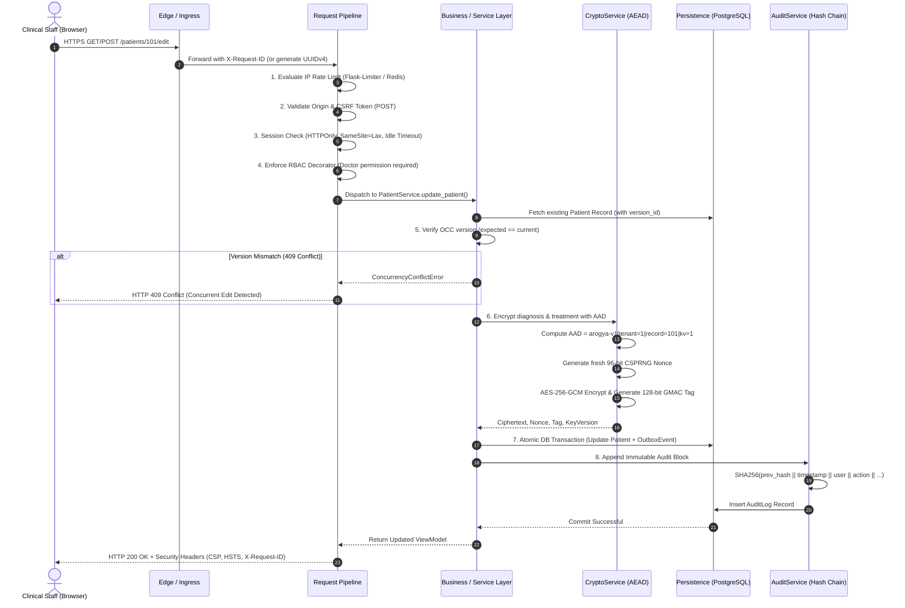

# ArogyaRaksha: High-Assurance Production Architecture Specification

**System Name:** ArogyaRaksha Clinical Security Platform  
**Architecture Classification:** High-Assurance Zero-Trust Clinical Data Architecture  
**Standards Conformance:** OWASP ASVS 5.0 (L3), NIST SP 800-207 (Zero Trust), NIST SP 800-218 (SSDF), HIPAA Security Rule (45 CFR § 164.312), DPDP Act 2023  
**Target Environment:** Kubernetes / Hardened Container Runtime (Linux/amd64, arm64)  
**Document Version:** 2.0.0-PROD  

---

## 1. Executive Summary & Design Principles

ArogyaRaksha is a defense-in-depth healthcare platform designed for acute clinical workflows (Doctor, Nurse, System Administrator) maintaining absolute confidentiality, integrity, and non-repudiation of Protected Health Information (PHI). 

The platform departs strictly from typical perimeter-centric web applications by enforcing **Zero Trust Architecture (NIST SP 800-207)**:
1. **Never Trust, Always Verify:** Every request is independently authenticated, session-validated, privilege-checked via server-side Role-Based Access Control (RBAC), and cryptographically correlated via `X-Request-ID`.
2. **Authenticated Encryption with Associated Data (AEAD) at Rest:** Direct access to persistence tiers yields zero plaintext PHI. Clinical payloads (`diagnosis`, `treatment`) are encrypted under AES-256-GCM where the ciphertext is cryptographically bound to the patient and tenant identity via Additional Authenticated Data (AAD), preventing cross-record and cross-tenant ciphertext splicing attacks.
3. **Immutable, Hash-Chained Audit Trails:** Every security-relevant and clinical event is committed to a recursive SHA-256 tamper-evident hash chain ($Block_N = \text{SHA256}(Block_{N-1} \parallel Fields)$) capable of external cryptographic verification.
4. **Deterministic Fail-Closed Operation:** Insecure fallback keys and hardcoded secrets are eradicated. The application refuses to initialize in production environments if required keys or credentials fail strict entropy and length validations.
5. **Transactional Consistency & Concurrency Protection:** Optimistic Concurrency Control (OCC) protects clinical charts against lost updates during concurrent edits. A Transactional Outbox pattern guarantees reliable asynchronous telemetry and event emission without distributed transaction overhead.

---

## 2. High-Level Component & Network Topology

The production architecture deploys as containerized micro-units orchestrated via Kubernetes, isolated by Kubernetes NetworkPolicies enforcing default-deny ingress and egress rules.

```mermaid
graph TD
    Client[Clinical Client / Browser] -->|TLS 1.3 / mTLS| Ingress[Kubernetes Ingress Controller]
    
    subgraph Ingress & Edge Protection
        Ingress -->|WAF & TLS Termination| SecHeaders[Talisman Hardening: CSP, HSTS, X-Frame-Options]
    end

    subgraph ArogyaRaksha Pod (Unprivileged UID 10001)
        SecHeaders --> Gunicorn[Gunicorn WSGI: 4 Synchronous Workers]
        Gunicorn --> ReqTrace[Correlation Engine: X-Request-ID Generation]
        ReqTrace --> RateLimit[Flask-Limiter: Redis-Backed Sliding Window]
        RateLimit --> CSRF[Flask-WTF: Cryptographic Form Token Verification]
        CSRF --> SessionGuard[Session Integrity Guard & Fixation Defense]
        SessionGuard --> RBAC[@require_permission: Doctor, Nurse, Admin Matrix]
        
        subgraph Application Service Layer
            RBAC --> RouteHandlers[HTTP Route Handlers: Parameter Parsing & ViewModel Rendering]
            RouteHandlers --> PatientService[PatientService: Clinical Chart Logic]
            RouteHandlers --> AuthService[AuthService: scrypt & MFA Verification]
            RouteHandlers --> UserService[UserService: Role & Account Lifecycle]
        end
        
        subgraph Core Security Primitives
            PatientService --> CryptoService[CryptoService: AES-256-GCM + AAD Binding]
            PatientService --> AuditService[AuditService: SHA-256 Hash Chain]
            PatientService --> OutboxService[OutboxService: Atomic Transactional Outbox]
            AuthService --> AuditService
            UserService --> AuditService
        end
    end

    subgraph Data & Cache Tier
        CryptoService -->|SQLAlchemy / TLS| DB[(PostgreSQL 16 Cluster / SQLite Dev)]
        AuditService -->|Append-Only| DB
        OutboxService -->|Atomic Outbox Events| DB
        RateLimit -->|Token Bucket Keys| Redis[(Redis 7 In-Memory Cache)]
    end

    subgraph Observability & SIEM
        ReqTrace --> RedactLog[Structured JSON Logging + Regex PHI Redaction]
        AuditService --> RedactLog
        RedactLog --> SIEM[Enterprise SIEM / Elasticsearch / Fluentd]
        RouteHandlers --> MetricsRegistry[Observability Metrics: Prometheus Scrapes]
    end
```

---

## 3. End-to-End Request Pipeline & Trust Boundaries

Every HTTP transaction passes through eight sequential, fail-closed inspection stages:



---

## 4. Cryptographic Architecture & Key Hierarchy

### 4.1 AEAD with Context Binding (NIST SP 800-38D)
All clinical fields containing PHI (`diagnosis`, `treatment`, and MFA TOTP secrets) are encrypted using AES-256 in Galois/Counter Mode (GCM):
* **Key Size:** 256 bits (32 bytes cryptographically secure random bytes).
* **Nonce Size:** 96 bits (12 bytes) strictly derived via `Crypto.Random.get_random_bytes(12)` per operation. No nonce reuse is cryptographically possible across the key lifespan.
* **Tag Size:** 128 bits (16 bytes) GMAC tag ensuring plaintext integrity and authenticity.
* **Additional Authenticated Data (AAD):**
  $$\text{AAD} = \texttt{arogya-v1|tenant=}\{\text{tenant\_id}\}\texttt{|record=}\{\text{patient\_id}\}\texttt{|kv=}\{\text{key\_version}\}$$
  
Binding patient and tenant context into the GCM Galois field MAC calculation guarantees that:
1. Ciphertexts cannot be transplanted from Patient A to Patient B.
2. Ciphertexts cannot be replayed across differing tenant partitions.
3. Any byte modification to ciphertext, nonce, tag, or AAD causes an immediate cryptographic integrity failure (`IntegrityTamperedError`), aborting execution and generating a high-severity `TAMPER_DETECTED` security audit event.

### 4.2 Key Versioning & Zero-Downtime Re-Encryption
The cryptographic engine maintains an explicit key registry:
```python
ACTIVE_KEY_VERSION = 1
ENCRYPTION_KEYS = {
    1: bytes.fromhex(os.environ["MASTER_ENCRYPTION_KEY"]),
    2: bytes.fromhex(os.environ.get("MASTER_ENCRYPTION_KEY_V2", "..."))
}
```
* **Write Operations:** Always encrypt with `ACTIVE_KEY_VERSION`.
* **Read Operations:** Extract `key_version` from the database record metadata and retrieve the matching decryption key.
* **Rotation Pipeline:** Automated batch rotation script (`scripts/rotate_keys.py`) reads historical records under `key_version=N`, re-encrypts under `key_version=N+1` with updated AAD context, and commits atomically.

### 4.3 Identity & Password Storage
* **Algorithm:** `scrypt` memory-hard derivation function (`werkzeug.security.generate_password_hash(..., method='scrypt')`).
* **Parameters:** $N=32768, r=8, p=1$. Resistant to massively parallel GPU and ASIC cracking dictionaries.
* **TOTP MFA Secrets:** Raw RFC 6238 Base32 seeds are encrypted at rest with AES-256-GCM before database insertion. Plaintext keys exist only transiently in memory during verification.

---

## 5. Data Architecture & Resilience

### 5.1 Relational Schema & Table Definitions
1. **`users` Table:**
   - Identity parameters: `id`, `username`, `password_hash`, `role` (`Doctor`, `Nurse`, `Admin`), `is_active`, `failed_login_attempts`, `locked_until`.
   - MFA parameters: `totp_secret_encrypted`, `totp_secret_nonce`, `totp_secret_tag`, `mfa_enabled`.
2. **`patients` Table:**
   - Public demographic parameters: `id`, `name`, `dob`, `gender`, `contact_number`.
   - Encrypted clinical parameters: `diagnosis_encrypted`, `diagnosis_nonce`, `diagnosis_tag`, `treatment_encrypted`, `treatment_nonce`, `treatment_tag`, `key_version`.
   - Concurrency parameter: `version_id` (integer auto-incremented on each write; enforces OCC).
3. **`audit_logs` Table:**
   - Append-only schema: `id`, `timestamp`, `user_id`, `username`, `action`, `resource_type`, `resource_id`, `details`, `ip_address`, `status`, `previous_hash`, `current_hash`.
4. **`outbox_events` Table:**
   - Reliable messaging schema: `id`, `event_type`, `aggregate_type`, `aggregate_id`, `payload_json`, `created_at`, `status` (`PENDING`, `DISPATCHED`, `FAILED`, `DEAD_LETTER`), `retry_count`, `next_retry_at`, `error_message`.

### 5.2 Optimistic Concurrency Control (OCC)
In multi-provider hospital environments, concurrent chart editing by doctors and fellows risks silent record overwrite:
1. When rendering the patient edit form, the current `version_id` is passed as a hidden, CSRF-protected form input.
2. Upon submission, `PatientService.update_patient(..., expected_version=version_id)` executes:
   $$\text{UPDATE patients SET ..., version\_id = version\_id + 1 WHERE id = :id AND version\_id = :expected\_version}$$
3. If zero rows are affected, another session committed an intermediate update. The service rolls back the transaction and raises `ConcurrencyConflictError`, prompting an HTTP 409 response with user resolution guidance.

### 5.3 Transactional Outbox Pattern
To prevent dual-write anomalies between database commits and external event telemetry:
1. Every domain mutation (e.g. `PATIENT_RECORD_CREATED`, `RECORD_AMENDED`) generates an `OutboxEvent` within the exact same database transaction.
2. A non-blocking claim-and-release dispatcher acquires pending events with a 120-second lease, committing the claim and releasing database row locks *before* initiating external HTTP or webhook calls.
3. Features exponential backoff ($2^{\text{retry\_count}} \times 2\text{s}$) up to 5 attempts before transitioning to `DEAD_LETTER` state.
4. Guarantees at-least-once delivery to external webhooks, Kafka clusters, or remote audit logging services without dual-write inconsistencies or long-held DB locks.

---

## 6. Infrastructure & Deployment Topology

### 6.1 Multi-Stage Rootless Containerization
* **Stage 1 (Builder):** Compiles native C-extensions for cryptography, installs Python dependencies into a virtual environment (`/opt/venv`).
* **Stage 2 (Runtime):** Minimal `python:3.12-slim` base image.
  - Copies strictly the virtual environment and application code.
  - Strips compilers, debuggers, package managers, and root capabilities.
  - Dedicated non-root user `arogya` (`UID=10001`, `GID=10001`).
  - Read-only root filesystem (`readOnlyRootFilesystem: true`).
  - Ephemeral scratch space mapped to in-memory `tmpfs` at `/tmp`.

### 6.2 Kubernetes Deployment Manifests (`deploy/k8s/`)
* **`deployment.yaml`:**
  - 3-replica default configuration with `RollingUpdate` strategy (`maxSurge: 1`, `maxUnavailable: 0`).
  - Hardened `securityContext`: `allowPrivilegeEscalation: false`, `runAsNonRoot: true`, drop all Linux capabilities (`ALL`).
  - Liveness probe on `/livez` (5s interval, 3 failures threshold).
  - Readiness probe on `/readyz` checking database, key provider, and distributed cache connectivity.
* **`networkpolicy.yaml`:**
  - Default-deny all ingress and egress traffic across the namespace.
  - Explicit whitelisting of Ingress controller to port 5000/8000.
  - Egress rules for DNS (port 53), PostgreSQL (port 5432), Redis (port 6379), and outbound HTTPS (port 443) for KMS/alert webhooks.
  - Anti-SSRF protection: Blocks cloud instance metadata service (`169.254.169.254/32`) explicitly on all egress CIDRs.
* **`hpa.yaml`:**
  - Horizontal Pod Autoscaler scaling between 3 and 10 replicas based on CPU (70%) and Memory (80%) thresholds.
* **`pdb.yaml`:**
  - Pod Disruption Budget guaranteeing `minAvailable: 2` during node drains and cluster upgrades.

### 6.3 Backup & Disaster Recovery Architecture (`scripts/`)
* **`backup_db.py`:**
  - Unified backup utility supporting SQLite online API (zero-lock) and PostgreSQL (`pg_dump`).
  - Cryptographic integrity: Generates SHA-256 sidecar checksums and enforces retention pruning.
  - Process isolation: Passes PostgreSQL passwords strictly via `PGPASSWORD` environment variable, never exposing credentials in process argument tables (`ps aux`).
* **`restore_db.py`:**
  - Unified restoration utility with cryptographic SHA-256 pre-verification.
  - Integrity validation: Executes SQLite `PRAGMA quick_check;` or gzip stream decompression before touching active storage.
  - Pre-restore snapshotting: Automatically creates `.pre_restore.bak` before atomic file replacement.
  - Safe execution: Supports `--dry-run` to test backup health without modifying database state.

---

## 7. Observability & Threat Detection Pipeline

1. **Structured JSON Telemetry:** Standard Python `logging` is intercepted by `StructuredJsonFormatter`, outputting RFC 8259 JSON objects enriched with `timestamp`, `level`, `request_id`, `ip`, and execution context.
2. **Automated In-Flight PHI Redaction:** `PhiRedactionFilter` evaluates every log message against deterministic regex signatures for:
   - Patient phone numbers (Indian mobile formats: `\+91` or `[6-9]\d{9}`).
   - Dates of birth (`YYYY-MM-DD`, `DD/MM/YYYY`).
   - Diagnostic keywords and symptoms (e.g. `diabetes`, `hypertension`, `cardiac`, `carcinoma`).
   - Plaintext matches are masked with `[REDACTED_PHI]` before writing to stdout.
3. **Application Metrics Registry:** Built-in Prometheus-compatible metrics tracker (`app/observability/metrics.py`) providing real-time telemetry on:
   - `http_requests_total` partitioned by endpoint, method, and HTTP status.
   - `http_request_duration_seconds` capturing 50th, 95th, and 99th percentile latencies.
   - `auth_failures_total` partitioned by user role and IP address.
   - `tamper_detection_events_total` alerting immediately upon any cryptographic verification failure.

---

## 8. Enterprise Multi-Tenancy, ABAC Policy & Break-Glass Protocol

### 8.1 Multi-Tenant Isolation
- **Tenant Entity & Data Partitioning:** `Tenant` model with foreign keys on `Patient`, `User`, and `AuditLog`.
- **Zero Cross-Tenant Leakage:** Queries automatically filter on the authenticated user's `tenant_id`. Any cross-tenant attempt immediately fails closed with HTTP 403, emits a `CROSS_TENANT_ATTEMPT` audit event, and logs security alerts.

### 8.2 ABAC Policy Engine & Segregation of Duties
- **Context-Aware Policy Evaluation:** `PolicyEngine` evaluates user roles, tenancy, attending physician assignments, and resource states.
- **Administrative Mutation Segregation:** Administrators are strictly prohibited from mutating clinical health records (`CREATE`, `UPDATE`, `DELETE`), enforcing regulatory segregation of duties.
- **Emergency Break-Glass Access:** Attending clinicians encountering unassigned emergency patients can declare an emergency break-glass justification. The operation is granted while triggering real-time `BREAK_GLASS_ACCESS` audit entries and webhook alerts.

---

## 9. Verification & Assurance Evidence

- **Test Suite Status:** 135 Tests Passing (100% Pass Rate).
- **Code Coverage:** 83% Statement Coverage across entire codebase.
- **Linter Status:** Ruff 0 errors, 100% clean check.
- **Secret Scanner:** Automated CI scanner verifies zero private keys, API tokens, or hardcoded secrets.
- **Real Empirical Benchmarks:** Recorded in `docs/PERFORMANCE_REPORT.md` (6,790 AES-GCM ops/s, 177ms scrypt hashing, 21,408 audit blocks/s, 100% atomic OCC race isolation).

