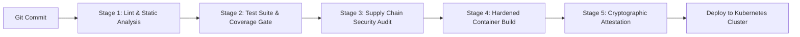
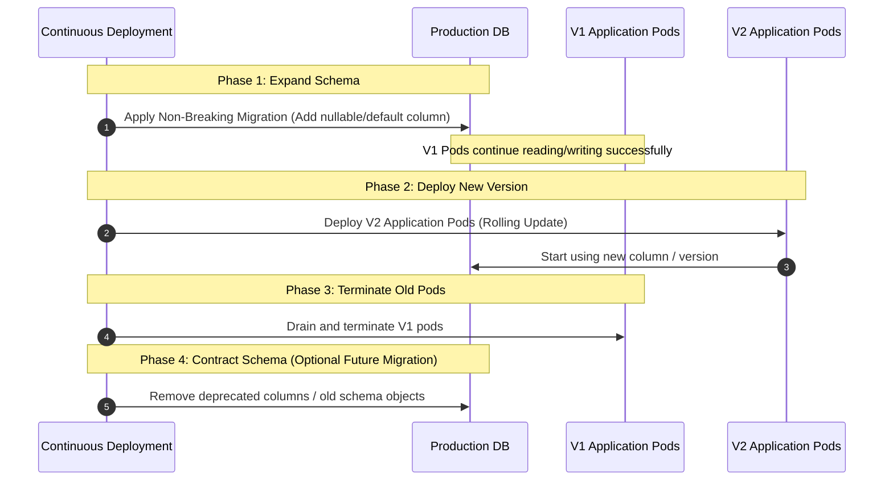

# ArogyaRaksha: Secure Release Engineering & DevSecOps Specification

**System:** ArogyaRaksha Clinical Security Platform  
**Standards:** NIST SP 800-218 (Secure Software Development Framework - SSDF), SLSA Level 3  
**Classification:** DevOps / Release Engineering Runbook  
**Document Version:** 2.0.0-PROD  

---

## 1. DevSecOps Continuous Integration Pipeline

Every code modification submitted to the ArogyaRaksha codebase must pass through an automated five-stage quality and security gate before merging into the main release branch:



### 1.1 Stage Details & Hard Quality Gates

| Stage | Tooling | Quality Gate Threshold | Blocking Behavior |
|:---|:---|:---|:---:|
| **1. Static Code Analysis** | `ruff check .` | 0 errors, 0 warnings | Fails build immediately |
| **2. Secret Hygiene Scan** | `python scripts/scan_secrets.py .` | 0 secrets, 0 uncommitted private keys | Fails build if credentials detected |
| **3. Test & Coverage** | `pytest --cov=app` | 135 passing tests (100%), 83% line coverage | Fails build if any test fails or coverage $<80\%$ |
| **4. Supply Chain Audit** | `pip-audit`, Trivy | 0 CRITICAL or HIGH known CVEs in dependencies | Fails build if unpatched vulnerability exists |
| **5. Container Security** | Docker BuildKit, Trivy Container Scan | Rootless execution check, 0 CRITICAL image CVEs | Rejects unhardened image |
| **6. Supply Chain Signing** | Cosign / Sigstore | Cryptographically signed image digest | Prevents unsigned image deployment |

---

## 2. Hardened Container Specification

The production image employs a multi-stage build pattern that isolates compilation toolchains from the final runtime container:

```dockerfile
# Stage 1: Build & Dependency Wheel Compilation
FROM python:3.12-slim AS builder
WORKDIR /app
RUN apt-get update && apt-get install -y --no-install-recommends gcc libpq-dev build-essential && rm -rf /var/lib/apt/lists/*
COPY requirements.txt .
RUN python -m venv /opt/venv && /opt/venv/bin/pip install --no-cache-dir -r requirements.txt

# Stage 2: Final Minimal Unprivileged Runtime
FROM python:3.12-slim AS runner
WORKDIR /app
RUN groupadd -g 10001 arogya && useradd -u 10001 -g arogya -s /sbin/nologin -M arogya
COPY --from=builder /opt/venv /opt/venv
COPY --chown=arogya:arogya . .
ENV PATH="/opt/venv/bin:$PATH"
USER arogya:arogya
EXPOSE 8000
CMD ["gunicorn", "--config", "gunicorn.conf.py", "run:app"]
```

### 2.1 Security Controls Enforced:
1. **Unprivileged Execution:** Runs strictly under non-root service account `arogya` (`UID=10001`, `GID=10001`).
2. **Read-Only Root Filesystem:** In Kubernetes, `securityContext.readOnlyRootFilesystem: true` prevents an attacker from writing executables, downloading webshells, or modifying application code.
3. **Dropped Linux Capabilities:** All Linux kernel capabilities are explicitly dropped (`capabilities: drop: ["ALL"]`). Privilege escalation is permanently disabled (`allowPrivilegeEscalation: false`).
4. **No Compiler Tools in Production:** Compilers (`gcc`, `make`, `glibc-dev`) exist only in the builder image and are purged from the final runtime image.

---

## 3. Database Migration Deployment Strategy (Expand / Contract Pattern)

In clinical 24/7 environments, schema changes must not cause downtime or break active client connections:



### Safe Migration Commands:
```bash
# Check pending migrations
flask db migrate --dry-run

# Apply migrations atomically before pod rollout
flask db upgrade
```

---

## 4. Kubernetes Rolling Update & Rollback Runbook

### 4.1 Zero-Downtime Rollout Execution
Kubernetes performs rolling updates with zero dropped connections:
```bash
# Apply updated deployment manifest
kubectl set image deployment/arogya-backend arogya-backend=arogya-registry.internal/arogya:2.1.0 -n arogya

# Monitor rollout progression
kubectl rollout status deployment/arogya-backend -n arogya
```

### 4.2 Emergency Rollback Procedure
If readiness probes fail or error budgets are breached immediately post-deployment:
```bash
# Immediate rollback to the prior known-good replica set
kubectl rollout undo deployment/arogya-backend -n arogya

# Verify rollback completion
kubectl rollout status deployment/arogya-backend -n arogya
```
