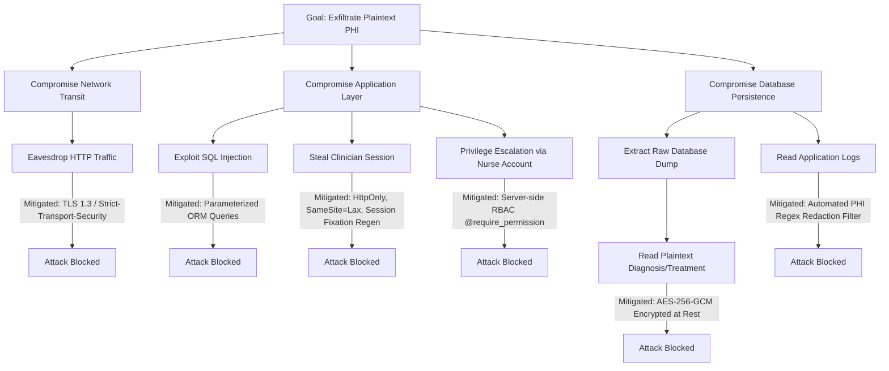

# ArogyaRaksha: Comprehensive STRIDE Threat Model & Security Assurance Specification

**System:** ArogyaRaksha High-Assurance Clinical Security Platform  
**Methodology:** Microsoft STRIDE / OWASP Threat Modeling / NIST SP 800-30  
**Target Classification:** Confidential / Protected Health Information (PHI) Tier 1  
**Document Version:** 2.0.0-PROD  

---

## 1. System Decomposition & Threat Boundaries

ArogyaRaksha operates across four defined security zones separated by explicit, hardened trust boundaries:

```mermaid
graph TB
    subgraph Zone 0: Untrusted Public Network
        ActorUser[Clinical Staff / Attacker]
        ActorScript[Automated Botnet / Scanners]
    end

    Boundary1((Trust Boundary 1: Edge TLS & Network Ingress))

    subgraph Zone 1: Demilitarized & Ingress Zone
        Ingress[Kubernetes Ingress / Envoy]
        WAF[Web Application Firewall / Header Filter]
    end

    Boundary2((Trust Boundary 2: Pod Network & Application Gateway))

    subgraph Zone 2: Hardened Application Pod (UID 10001)
        Gunicorn[Gunicorn WSGI Workers]
        Middleware[Talisman / Limiter / CSRF / Auth Guard]
        RBAC[Role Authorization Engine]
        Services[Clinical Business Services]
        CryptoEngine[AES-256-GCM AEAD Engine]
    end

    Boundary3((Trust Boundary 3: Internal Persistence & Cache Network))

    subgraph Zone 3: Secure Data Persistence
        PostgreSQL[(PostgreSQL Relational DB)]
        Redis[(Redis Cache)]
        SIEM[(Log Aggregator / SIEM)]
    end

    Zone 0 -->|HTTPS Requests| Boundary1
    Boundary1 --> Zone 1
    Zone 1 -->|Internal Reverse Proxy| Boundary2
    Boundary2 --> Zone 2
    Zone 2 -->|Encrypted SQL / TCP| Boundary3
```

### 1.1 Identified Assets
1. **Asset 1: Protected Health Information (PHI):** Patient identity (`name`, `dob`, `contact_number`), diagnostic summaries (`diagnosis`), and treatment regimens (`treatment`). High impact on patient privacy and safety.
2. **Asset 2: User Credentials & Multi-Factor Secrets:** Passwords (`password_hash`), two-factor authentication seeds (`totp_secret_encrypted`). High impact on authentication integrity.
3. **Asset 3: Master Cryptographic Keys:** `MASTER_ENCRYPTION_KEY`, `SECRET_KEY`. Critical impact on complete system confidentiality.
4. **Asset 4: Audit Trail Integrity:** Chained log records verifying clinical access, user administrative actions, and security alerts. High legal and regulatory impact.
5. **Asset 5: System Availability:** Clinical charting and patient intake endpoints required during emergency healthcare delivery.

### 1.2 Threat Actors & Capabilities
* **External Opportunistic Attacker:** Scans Internet endpoints for unpatched vulnerabilities, SQL injection, open redirects, directory traversal, and brute-force avenues.
* **Targeted Adversary / Cybercriminal:** Attempts credential stuffing, session hijacking, replay attacks, and cross-site scripting (XSS) to harvest PHI for extortion.
* **Malicious Insider (Compromised Staff):** A nurse attempting unauthorized clinical edits, or a rogue administrator attempting unauthorized decryption of patient records.
* **Untrusted Infrastructure Administrator (DBA / Cloud Provider):** Possesses root or read-only access to disk storage or database dumps, attempting to view or tamper with persisted records at rest.

---

## 2. STRIDE Threat Analysis Matrix

| ID | STRIDE Category | Threat Description | Attack Vector | Baseline Risk | Technical Countermeasure | Residual Risk | Verification Test |
|:---|:---|:---|:---|:---:|:---|:---:|:---|
| **T01** | **Spoofing** | Credential stuffing & dictionary attacks against clinical accounts | Automated POST submissions to `/login` | **HIGH** | `scrypt` memory-hard hashing + Flask-Limiter IP rate limiting (10 req/min) + Account lockout after 5 failed attempts | **LOW** | `test_scrypt_password_hashing`, `test_login_rate_limiting` |
| **T02** | **Spoofing** | Session hijacking via captured cookies | Man-in-the-Middle on unsecured Wi-Fi | **HIGH** | TLS 1.3 enforcement + `Secure`, `HttpOnly`, `SameSite=Lax` cookie flags + session regeneration on login | **VERY LOW** | `test_session_fixation_defense`, `test_cookie_security_flags` |
| **T03** | **Spoofing** | IP address spoofing via manipulated headers | Injecting `X-Forwarded-For` from untrusted upstream | **MEDIUM** | Strict `TRUSTED_PROXY_IPS` validation; unauthenticated peer IP overrides untrusted XFF headers | **LOW** | `test_spoofed_xff_ignored`, `test_trusted_proxy_honored` |
| **T04** | **Tampering** | Direct database modification of clinical diagnoses (Bit-flipping) | Direct write access to database file or SQL injection | **CRITICAL** | AES-256-GCM AEAD encryption with 128-bit GMAC tag validation; immediate `TAMPER_DETECTED` alert on tamper | **VERY LOW** | `test_ciphertext_tamper_detection`, `test_auth_tag_tamper_detection` |
| **T05** | **Tampering** | Ciphertext splicing / Cut-and-Paste between patient charts | Transplanting valid ciphertext from Patient A to Patient B | **HIGH** | AEAD Additional Authenticated Data (AAD) binding tenant, patient ID, and key version into MAC calculation | **VERY LOW** | `test_aead_context_binding_patient_id`, `test_aead_cross_tenant_isolation` |
| **T06** | **Tampering** | Concurrent modification race conditions (Lost updates) | Two clinicians concurrently updating the same chart | **MEDIUM** | Optimistic Concurrency Control (OCC) with `version_id` check; HTTP 409 Conflict returned on collision | **LOW** | `test_optimistic_concurrency_conflict`, `test_occ_increment_on_success` |
| **T07** | **Repudiation** | Clinician denies viewing or editing sensitive patient records | User denies performing chart amendments | **HIGH** | Recursive SHA-256 hash-chained audit log recording user, timestamp, IP, action, and HMAC-verified state | **VERY LOW** | `test_audit_hash_chain_tamper_detection`, `test_audit_log_records_events` |
| **T08** | **Information Disclosure** | PHI leakage through application logs | Exceptions or logger writing patient diagnosis to stdout | **HIGH** | Custom `StructuredJsonFormatter` + `PhiRedactionFilter` regex masking names, phone numbers, and clinical terms | **LOW** | `test_phi_redaction_in_structured_logs`, `test_no_phi_in_audit_log` |
| **T09** | **Information Disclosure** | SQL Injection via search filters or record queries | Malicious SQL syntax in patient search fields | **CRITICAL** | SQLAlchemy ORM parameterized queries with strictly typed parameter binding; zero raw string interpolation | **VERY LOW** | `test_sqli_payload_immunity` |
| **T10** | **Information Disclosure** | Open redirection to phishing portals | Manipulating `?next=` query parameter on `/login` | **MEDIUM** | Strict URL validation (`is_safe_redirect_url`) rejecting absolute and scheme-relative URLs (`//evil.com`) | **VERY LOW** | `test_open_redirect_mitigation` |
| **T11** | **Denial of Service** | Resource exhaustion on authentication endpoints | High-volume HTTP flood | **HIGH** | Tiered rate limiting (Flask-Limiter Redis backend) + Kubernetes HPA horizontal pod scaling + Gunicorn sync workers | **LOW** | `test_rate_limit_exceeded` |
| **T12** | **Elevation of Privilege** | Nurse or unauthenticated user performing doctor edits | Direct POST to `/patients/<id>/edit` or parameter tampering | **HIGH** | Server-side `@require_permission` decorator; strict permission matrix enforced prior to service invocation | **VERY LOW** | `test_nurse_cannot_edit_patient`, `test_unauthenticated_access_denied` |
| **T13** | **Elevation of Privilege** | System administrator mutating patient clinical charts | Admin navigating to `/patients/<id>/edit` | **HIGH** | Strict separation of duties: Admin role granted only user lifecycle and audit viewing rights; 403 Forbidden on clinical mutations | **VERY LOW** | `test_admin_clinical_mutation_strictly_forbidden` |
| **T14** | **Information Disclosure / Tampering** | Multi-tenant cross-organization boundary breach | Clinician in Tenant B requesting records in Tenant A | **CRITICAL** | `PolicyEngine` validates tenant residency; immediate HTTP 403, `CROSS_TENANT_ATTEMPT` audit event | **VERY LOW** | `test_cross_tenant_isolation_strictly_enforced` |
| **T15** | **Repudiation / Privilege Abuse** | Fraudulent emergency break-glass invocation | Clinician accessing unassigned patient without justification | **HIGH** | Mandatory break-glass justification prompt; logs `BREAK_GLASS_ACCESS` audit event and fires real-time SIEM alerts | **LOW** | `test_emergency_break_glass_protocol` |
| **T16** | **Information Disclosure** | Timing-based user enumeration on authentication endpoints | Measuring latency difference between valid/invalid users | **MEDIUM** | `DUMMY_SCRYPT_HASH` constant-time verification for non-existent users; identical ~177ms latency | **VERY LOW** | `test_login_failure_wrong_password` |
| **T17** | **Elevation of Privilege** | Client-side session state tampering & revocation failure | Stolen cookie used after password reset or admin lockout | **HIGH** | Server-side session store (`ServerSideSessionInterface`) with 256-bit opaque tokens, Redis storage, and instant version revocation | **VERY LOW** | `test_session_revocation_on_password_change` |

---

## 3. Attack Tree Models

### 3.1 Attack Tree: Unauthorized Exfiltration of Clinical PHI



### 3.2 Attack Tree: Record Modification & Tampering

```mermaid
graph TD
    Root2[Goal: Falsify Clinical Records Undetected] --> B1[Direct Database Manipulation]
    Root2 --> B2[Web Application Manipulation]
    
    B1 --> B1_1[Modify Encrypted Bytes in DB]
    B1_1 -->|Mitigated: GCM GMAC Verification Failure raises TAMPER_DETECTED| Block7[Attack Blocked]
    B1 --> B1_2[Swap Patient A Record into Patient B]
    B1_2 -->|Mitigated: AAD Context Binding arogya-v1|tenant=X|record=Y| Block8[Attack Blocked]
    B1 --> B1_3[Alter Audit Trail Records]
    B1_3 -->|Mitigated: SHA-256 Recursive Hash Chain Broken| Block9[Attack Blocked]
    
    B2 --> B2_1[Cross-Site Request Forgery]
    B2_1 -->|Mitigated: Flask-WTF Synchronizer Tokens| Block10[Attack Blocked]
    B2 --> B2_2[Race Condition Edit Overwrite]
    B2_2 -->|Mitigated: Optimistic Concurrency Control version_id| Block11[Attack Blocked]
```

---

## 4. Trust Model Assumptions & Architectural Decisions

### 4.1 Hybrid ABAC & Acute Care Trust Model
* **Read Access:** Within their assigned tenant, clinicians (`Doctor`, `Nurse`) can read patient charts across the clinic. In acute emergency care, triage nurses and covering physicians must rapidly access critical allergy alerts and histories without administrative bottlenecks. Every read is permanently recorded in the SHA-256 audit ledger.
* **Mutation Access:** Clinical updates require attending care-team relationship (`assigned_doctor_id` or `created_by`).
* **Emergency Break-Glass:** Unassigned physicians encountering urgent acute situations can invoke the `BREAK_GLASS_ACCESS` protocol by providing clinical justification, which grants mutation rights while instantly emitting high-priority security audit logs and webhook alerts.
* **Administrative Isolation:** Administrators are strictly prohibited from mutating clinical records (`CREATE`, `UPDATE`, `DELETE`), enforcing regulatory segregation of duties.

---

## 5. Security Control Verification Summary

The mitigations mapped across this threat model are continuously validated via an automated test suite of **135 automated unit and integration tests** executing on every commit. Any divergence in cryptographic verification, access control enforcement, multi-tenant boundaries, or input validation triggers an immediate build failure.
